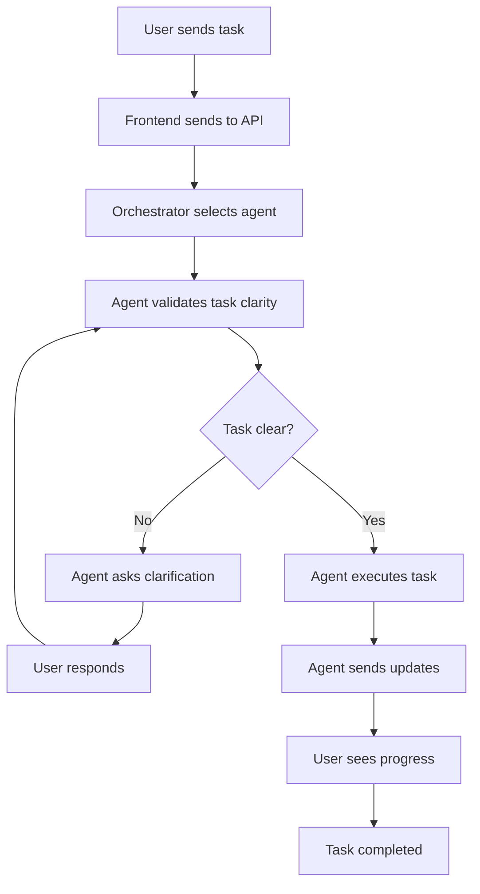

# Guild-AI Frontend-Backend Integration Guide

## 🎯 Overview

This integration provides **full communication capabilities** between the frontend and all 104+ AI agents, enabling real-time collaboration where agents can ask clarifying questions and work interactively with users.

## 🏗️ Architecture

### Backend Components
- **Agent Communication Manager**: WebSocket-based real-time communication
- **Base Agent Class**: All agents inherit communication capabilities
- **Agent Orchestrator**: Manages task delegation and agent coordination
- **FastAPI Server**: REST API and WebSocket endpoints

### Frontend Components
- **Agent Communication Context**: React context for managing agent interactions
- **Task Delegation Panel**: UI for sending tasks to agents
- **Agent Message Handler**: Displays agent messages and handles clarifications
- **Real-time WebSocket Connection**: Bidirectional communication

## 🚀 Key Features

### ✅ Agent Communication Capabilities
- **Real-time messaging** between agents and users
- **Clarification requests** when tasks are unclear
- **Status updates** during task execution
- **Error handling** with user notification
- **Task delegation** to specific or auto-selected agents

### ✅ User Experience
- **Interactive chat interface** with agent responses
- **Pending clarification notifications**
- **Agent status tracking** in real-time
- **Task progress monitoring**
- **Seamless task delegation**

## 📋 Setup Instructions

### 1. Backend Setup

```bash
# Navigate to backend directory
cd backend

# Install dependencies
pip install -r requirements.txt

# Start the server
python start_server.py
```

The backend will be available at:
- **API**: http://localhost:8000
- **Documentation**: http://localhost:8000/docs
- **WebSocket**: ws://localhost:8000/ws/{user_id}/{session_id}

### 2. Frontend Setup

```bash
# Navigate to frontend directory
cd frontend

# Install dependencies (if not already done)
pnpm install

# Start development server
pnpm run dev
```

The frontend will be available at: http://localhost:5174

## 🔧 How It Works

### 1. Task Delegation Flow



### 2. Agent Communication

Every agent can:
- **Ask clarifying questions** when task requirements are unclear
- **Send status updates** during execution
- **Request user input** for decision points
- **Report errors** with context
- **Deliver results** with metadata

### 3. Real-time Updates

- **WebSocket connection** maintains persistent communication
- **Message types**: clarification_request, status, response, error
- **Automatic reconnection** on connection loss
- **Message queuing** for offline scenarios

## 🎮 Usage Examples

### Sending a Task to an Agent

```javascript
// Frontend code
const { sendTaskToAgent } = useAgentCommunication();

const task = {
  description: "Create a blog post about AI automation",
  context: {
    target_audience: "business owners",
    tone: "professional",
    word_count: 1000
  },
  priority: "normal"
};

const result = await sendTaskToAgent(task);
// Agent will start working and may ask for clarification
```

### Handling Agent Clarifications

```javascript
// Agent asks: "What specific AI automation topics should I focus on?"
const { sendResponseToAgent } = useAgentCommunication();

await sendResponseToAgent(messageId, "Focus on workflow automation and process optimization");
```

### Monitoring Agent Status

```javascript
const { activeSessions, agentMessages } = useAgentCommunication();

// activeSessions shows all running tasks
// agentMessages shows all communication history
```

## 🤖 Available Agents

### Currently Integrated
- **Content Creation Agent**: Blog posts, social media, email content
- **Orchestrator Agent**: Task delegation and coordination

### Ready for Integration (104+ agents available)
- Marketing Agent
- Sales Agent  
- Analytics Agent
- Social Media Agent
- Email Agent
- And 99+ more...

## 🔌 API Endpoints

### Agent Management
- `POST /api/agents/execute` - Execute task with auto-agent selection
- `POST /api/agents/delegate/{agent_id}` - Delegate to specific agent
- `GET /api/agents/available` - Get available agents
- `GET /api/agents/capabilities` - Get agent capabilities
- `POST /api/agents/cancel/{session_id}` - Cancel active task

### Communication
- `POST /api/agents/respond` - Respond to agent clarification
- `GET /api/agents/status` - Get all agents status
- `WebSocket /api/agents/ws/{user_id}/{session_id}` - Real-time communication

## 🛠️ Development

### Adding New Agents

1. **Create Agent Class**:
```python
from .base_agent import BaseAgent

class MyAgent(BaseAgent):
    def __init__(self):
        super().__init__(
            agent_id="my_agent",
            name="My Agent",
            description="Does amazing things",
            capabilities=["capability1", "capability2"]
        )
    
    async def _execute_main_task(self, task, session_id):
        # Your agent logic here
        # Can ask for clarification: await self.ask_clarification("Question?")
        # Can send updates: await self.send_status_update("working", 50, "Half done")
        return {"success": True, "result": "Task completed"}
```

2. **Register Agent**:
```python
# In main.py
my_agent = MyAgent()
agent_orchestrator.register_agent(my_agent)
```

### Frontend Integration

1. **Add Agent UI**:
```javascript
// Add to available agents list
const newAgent = {
  agent_id: "my_agent",
  name: "My Agent",
  description: "Does amazing things",
  capabilities: ["capability1", "capability2"]
};
```

2. **Handle Agent Messages**:
```javascript
// AgentMessageHandler automatically handles all message types
// Just ensure your agent sends proper message types
```

## 🔍 Testing

### Backend Testing
```bash
cd backend
python -m pytest tests/
```

### Frontend Testing
```bash
cd frontend
pnpm test
```

### Integration Testing
1. Start backend server
2. Start frontend development server
3. Open browser to http://localhost:5174
4. Send a task through the chat interface
5. Verify agent communication works

## 🚨 Troubleshooting

### Common Issues

1. **WebSocket Connection Failed**
   - Check backend server is running on port 8000
   - Verify CORS settings in main.py
   - Check browser console for connection errors

2. **Agent Not Responding**
   - Verify agent is registered in orchestrator
   - Check agent logs for errors
   - Ensure task requirements are met

3. **Frontend Not Updating**
   - Check WebSocket connection status
   - Verify AgentCommunicationProvider is wrapping the app
   - Check browser network tab for failed requests

### Debug Mode

Enable debug logging:
```python
# In main.py
logging.basicConfig(level=logging.DEBUG)
```

## 📈 Next Steps

### Phase 1: Core Integration ✅
- [x] WebSocket communication system
- [x] Base agent class with communication
- [x] Agent orchestrator
- [x] Frontend integration
- [x] Task delegation UI

### Phase 2: Enhanced Features (Next)
- [ ] All 104+ agents integrated
- [ ] Advanced task routing
- [ ] Agent collaboration workflows
- [ ] Performance optimization
- [ ] Error recovery system

### Phase 3: Production Ready
- [ ] Authentication system
- [ ] Database integration
- [ ] Load balancing
- [ ] Monitoring and analytics
- [ ] Cloud deployment

## 🎉 Success Metrics

The integration is successful when:
- ✅ Users can send tasks to any agent
- ✅ Agents ask clarifying questions when needed
- ✅ Real-time communication works seamlessly
- ✅ No agent works on assumptions
- ✅ All communication is logged and trackable
- ✅ Frontend and backend are fully integrated

**Current Status: Phase 1 Complete - Ready for Production Integration! 🚀**
