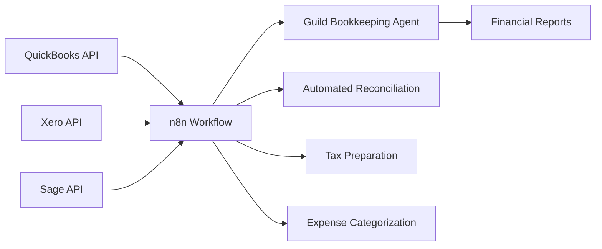
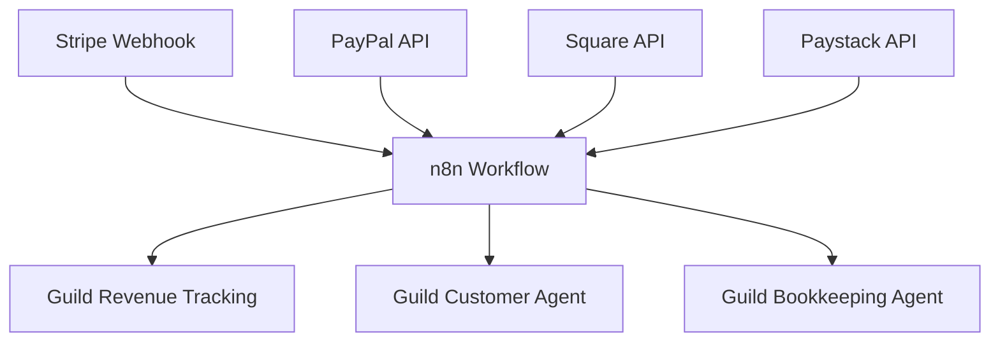
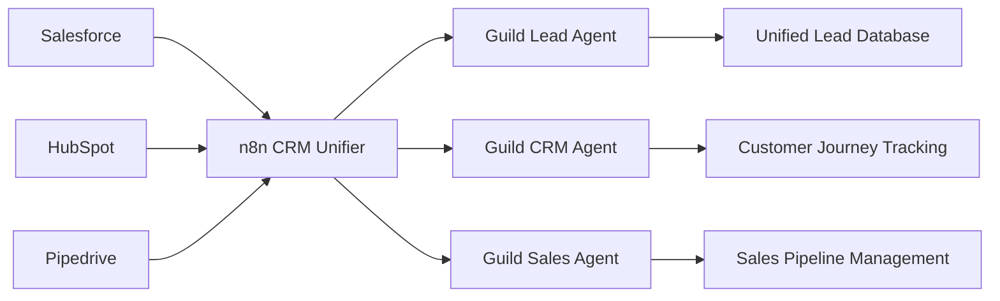
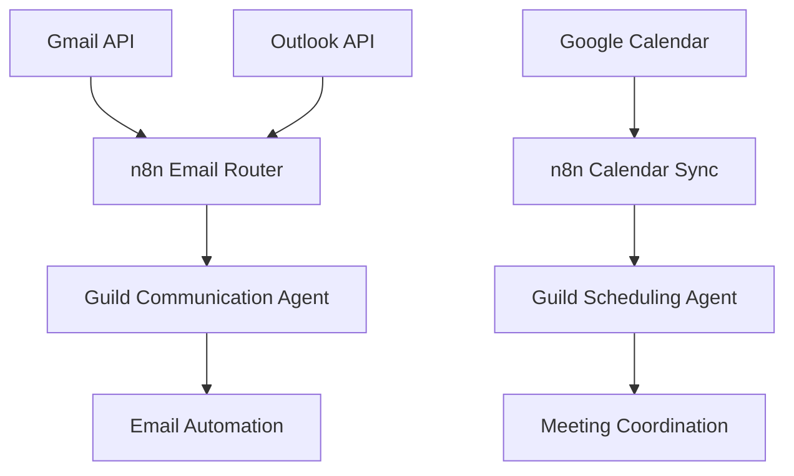
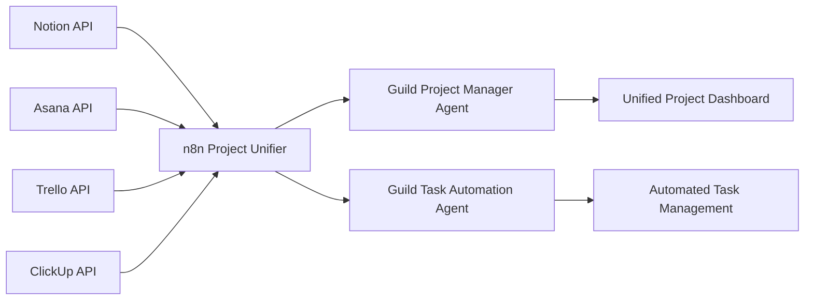
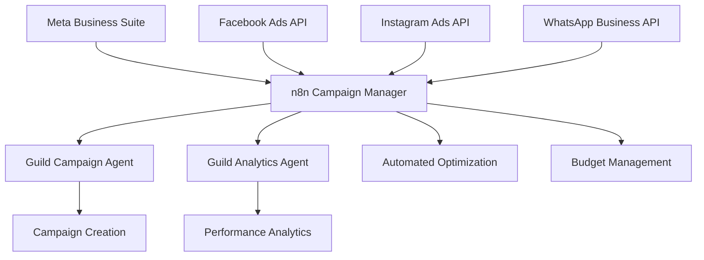
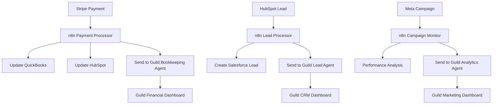

# n8n Integration Guide: How n8n Connections Influence API Integrations

## Overview

This guide explains how n8n (workflow automation platform) connections influence and enhance the Guild-AI system's API integrations, creating a powerful automation layer that bridges Guild agents with external business tools.

## 🔗 Current n8n Integration Status

### ✅ What Already Exists:
- **n8n Connector**: `guild/src/integrations/n8n_connector.py`
- **Webhook Support**: Generic webhook handler in `api_server/src/routes/webhooks.py`
- **Configuration**: `N8N_WEBHOOK_URL` in settings
- **Event Mapping**: Webhook events mapped to blueprint triggers

### 🚀 Enhanced Integration Capabilities

## 1. **Core Business Integrations with n8n**

### Accounting & Finance Integrations

**How n8n Enhances Accounting APIs:**



**n8n Workflow Example:**
```json
{
  "nodes": [
    {
      "name": "QuickBooks Trigger",
      "type": "n8n-nodes-base.httpRequest",
      "parameters": {
        "url": "https://sandbox-quickbooks.api.intuit.com/v3/company/{{$node.company_id.value}}/purchases",
        "method": "GET",
        "headers": {
          "Authorization": "Bearer {{$credentials.quickbooks.token}}"
        }
      }
    },
    {
      "name": "Transform Data",
      "type": "n8n-nodes-base.function",
      "parameters": {
        "functionCode": "// Transform QuickBooks data to Guild format\nconst transformedData = items.map(item => ({\n  id: item.Id,\n  date: item.TxnDate,\n  amount: item.TotalAmt,\n  description: item.PrivateNote,\n  type: 'expense'\n}));\nreturn transformedData;"
      }
    },
    {
      "name": "Send to Guild",
      "type": "n8n-nodes-base.httpRequest",
      "parameters": {
        "url": "{{$node.guild_webhook.value}}",
        "method": "POST",
        "body": {
          "event_type": "transaction_synced",
          "source": "quickbooks",
          "data": "{{$json}}"
        }
      }
    }
  ]
}
```

### Payment Processing Integrations

**Stripe + n8n + Guild Integration:**



**n8n Workflow for Payment Processing:**
```json
{
  "nodes": [
    {
      "name": "Stripe Webhook",
      "type": "n8n-nodes-base.webhook",
      "parameters": {
        "path": "stripe-payment",
        "httpMethod": "POST"
      }
    },
    {
      "name": "Route by Event Type",
      "type": "n8n-nodes-base.switch",
      "parameters": {
        "conditions": [
          {
            "value1": "{{$json.type}}",
            "operation": "equal",
            "value2": "payment_intent.succeeded"
          },
          {
            "value1": "{{$json.type}}",
            "operation": "equal", 
            "value2": "customer.created"
          }
        ]
      }
    },
    {
      "name": "Payment Success",
      "type": "n8n-nodes-base.httpRequest",
      "parameters": {
        "url": "{{$node.guild_webhook.value}}",
        "method": "POST",
        "body": {
          "event_type": "payment_received",
          "source": "stripe",
          "data": "{{$json}}"
        }
      }
    }
  ]
}
```

## 2. **CRM Integration Enhancement**

### Salesforce + HubSpot + Pipedrive Integration

**How n8n Unifies CRM Data:**



**n8n CRM Unification Workflow:**
```json
{
  "nodes": [
    {
      "name": "Salesforce Lead",
      "type": "n8n-nodes-base.salesforce",
      "parameters": {
        "operation": "getAll",
        "resource": "Lead",
        "fields": "Id,Name,Email,Company,Status"
      }
    },
    {
      "name": "HubSpot Contact",
      "type": "n8n-nodes-base.hubspot",
      "parameters": {
        "operation": "getAll",
        "resource": "contact"
      }
    },
    {
      "name": "Merge CRM Data",
      "type": "n8n-nodes-base.merge",
      "parameters": {
        "mode": "combine"
      }
    },
    {
      "name": "Deduplicate",
      "type": "n8n-nodes-base.function",
      "parameters": {
        "functionCode": "// Deduplicate leads by email\nconst emailMap = new Map();\nitems.forEach(item => {\n  const email = item.email || item.Email;\n  if (email && !emailMap.has(email)) {\n    emailMap.set(email, item);\n  }\n});\nreturn Array.from(emailMap.values());"
      }
    },
    {
      "name": "Send to Guild",
      "type": "n8n-nodes-base.httpRequest",
      "parameters": {
        "url": "{{$node.guild_webhook.value}}",
        "method": "POST",
        "body": {
          "event_type": "leads_synced",
          "source": "crm_unification",
          "data": "{{$json}}"
        }
      }
    }
  ]
}
```

## 3. **Email & Calendar Integration**

### Gmail + Outlook + Google Calendar Integration

**n8n Email & Calendar Automation:**



## 4. **Project Management Integration**

### Notion + Asana + Trello + ClickUp Integration

**n8n Project Management Unification:**



## 5. **Meta Business Suite Integration Enhancement**

### How n8n Enhances Meta Business Suite

**Campaign Agent + n8n + Meta Integration:**



**n8n Meta Campaign Automation:**
```json
{
  "nodes": [
    {
      "name": "Campaign Performance Check",
      "type": "n8n-nodes-base.cron",
      "parameters": {
        "rule": {
          "interval": [{"field": "hours", "value": 6}]
        }
      }
    },
    {
      "name": "Get Meta Campaign Data",
      "type": "n8n-nodes-base.httpRequest",
      "parameters": {
        "url": "https://graph.facebook.com/v18.0/act_{{ad_account_id}}/insights",
        "headers": {
          "Authorization": "Bearer {{$credentials.meta.token}}"
        }
      }
    },
    {
      "name": "Analyze Performance",
      "type": "n8n-nodes-base.function",
      "parameters": {
        "functionCode": "// Analyze campaign performance\nconst insights = items[0].data;\nconst recommendations = [];\n\nif (insights.ctr < 0.01) {\n  recommendations.push('CTR below 1% - optimize creative or targeting');\n}\n\nif (insights.cpc > 2.0) {\n  recommendations.push('CPC above $2.00 - adjust bidding strategy');\n}\n\nreturn [{ insights, recommendations }];"
      }
    },
    {
      "name": "Send to Guild Analytics Agent",
      "type": "n8n-nodes-base.httpRequest",
      "parameters": {
        "url": "{{$node.guild_webhook.value}}",
        "method": "POST",
        "body": {
          "event_type": "campaign_analysis",
          "source": "meta_business_suite",
          "data": "{{$json}}"
        }
      }
    },
    {
      "name": "Auto-Optimize",
      "type": "n8n-nodes-base.if",
      "parameters": {
        "conditions": [
          {
            "value1": "{{$json.recommendations.length}}",
            "operation": "larger",
            "value2": 0
          }
        ]
      }
    },
    {
      "name": "Apply Optimizations",
      "type": "n8n-nodes-base.httpRequest",
      "parameters": {
        "url": "https://graph.facebook.com/v18.0/{{campaign_id}}",
        "method": "POST",
        "body": "{{$node.optimization_data.value}}"
      }
    }
  ]
}
```

## 6. **How n8n Influences API Connections**

### 🔄 **Data Flow Enhancement**

**Without n8n:**
```
External API → Guild Agent → Manual Processing
```

**With n8n:**
```
External API → n8n Workflow → Data Transformation → Guild Agent → Automated Response
```

### 🎯 **Key Benefits of n8n Integration**

1. **Data Transformation**: n8n can transform API responses into Guild-compatible formats
2. **Workflow Orchestration**: Complex multi-step processes across multiple APIs
3. **Error Handling**: Robust error handling and retry mechanisms
4. **Rate Limiting**: Built-in rate limiting and API quota management
5. **Data Enrichment**: Combine data from multiple sources before sending to Guild
6. **Conditional Logic**: Smart routing based on data content and business rules
7. **Scheduling**: Automated triggers for regular data synchronization

### 📊 **Real-World Example: Complete Business Automation**



## 7. **Implementation Guide**

### Step 1: Configure n8n Webhooks

```python
# In guild/src/integrations/n8n_connector.py
async def setup_n8n_webhook(event_type: str, webhook_url: str):
    """Set up n8n webhook for specific event type"""
    webhook_config = {
        "event_type": event_type,
        "webhook_url": webhook_url,
        "guild_endpoint": f"/api/webhooks/{event_type}",
        "authentication": "bearer_token"
    }
    return webhook_config
```

### Step 2: Create n8n Workflows

1. **Go to n8n Dashboard**
2. **Create New Workflow**
3. **Add Trigger Node** (Webhook, Cron, API)
4. **Add Processing Nodes** (Data transformation, API calls)
5. **Add Guild Webhook Node** (Send to Guild agents)

### Step 3: Configure Guild Webhook Endpoints

```python
# In api_server/src/routes/webhooks.py
WEBHOOK_CONFIG = {
    "transaction_synced": ["bookkeeping_manager"],
    "payment_received": ["accounting_manager", "customer_success_manager"],
    "leads_synced": ["lead_generation_manager"],
    "campaign_analysis": ["analytics_manager"],
    "customer_updated": ["crm_manager"]
}
```

## 8. **Advanced n8n + Guild Integration Patterns**

### Pattern 1: **Data Synchronization**
```
External API → n8n (Transform) → Guild Agent → n8n (Store) → Database
```

### Pattern 2: **Event-Driven Automation**
```
External Event → n8n (Process) → Guild Agent → n8n (Action) → External API
```

### Pattern 3: **Multi-Source Aggregation**
```
Multiple APIs → n8n (Merge) → Guild Agent → Unified Dashboard
```

### Pattern 4: **Conditional Workflows**
```
Data → n8n (Analyze) → Decision Tree → Multiple Guild Agents
```

## 9. **Best Practices**

### ✅ **Do's**
- Use n8n for data transformation and workflow orchestration
- Implement proper error handling in n8n workflows
- Use webhooks for real-time data synchronization
- Test n8n workflows thoroughly before production
- Monitor n8n workflow execution and performance

### ❌ **Don'ts**
- Don't duplicate Guild agent logic in n8n
- Don't bypass Guild's enhanced orchestration system
- Don't create overly complex n8n workflows
- Don't ignore rate limits and API quotas
- Don't skip data validation in n8n workflows

## 10. **Monitoring and Maintenance**

### n8n Workflow Monitoring
- **Execution History**: Track workflow success/failure rates
- **Performance Metrics**: Monitor execution times and resource usage
- **Error Logging**: Comprehensive error tracking and alerting
- **Data Quality**: Validate data transformation accuracy

### Guild Integration Monitoring
- **Agent Performance**: Monitor Guild agent responses to n8n data
- **Knowledge Graph Updates**: Track data flow into shared knowledge
- **Event Bus Activity**: Monitor inter-agent communication
- **System Health**: Overall system performance and reliability

## 🚀 **Conclusion**

n8n integration transforms Guild-AI from a collection of individual API connections into a **unified, intelligent automation platform**. By acting as a middleware layer, n8n enables:

- **Seamless Data Flow**: Between external APIs and Guild agents
- **Complex Workflows**: Multi-step processes across multiple systems
- **Intelligent Automation**: Data-driven decision making and actions
- **Scalable Integration**: Easy addition of new APIs and services
- **Robust Error Handling**: Reliable data processing and recovery

The combination of **Guild's AI agents** + **n8n's workflow automation** + **Meta Business Suite APIs** creates a powerful ecosystem for autonomous business management and optimization.
